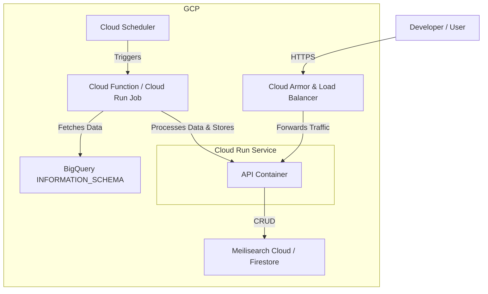

# BigQuery Cost Optimization Application: Architecture & Design

**Author**: Cloud Software and DevOps Architect
**Version**: 1.0

## 1. Overview

This document outlines the architecture for a BigQuery Cost Optimization application. The system is designed to periodically analyze BigQuery usage data, identify optimization opportunities, and provide actionable recommendations through a simple API. The initial design focuses on a local Docker-based setup for development and testing, with a clear path to cloud deployment.

## 2. System Architecture

The architecture is composed of a data processing service with a RESTful API, a search-optimized database for storing jobs and recommendations, and a periodic scheduler to trigger the analysis workflow.

### 2.1. Component Diagram

The following diagram illustrates the components and their interactions in the local Docker environment.

```mermaid
graph TD
    subgraph Local Docker Environment
        direction LR
        subgraph "API Service (bq_optimizer_api)"
            direction TB
            A[Uvicorn Server]
            B[FastAPI App]
            C[APScheduler]
            A --> B
            B --> C
        end

        subgraph "Database Service (meilisearch_db)"
            direction TB
            D[Meilisearch Engine]
            E[Indexes: jobs, recommendations]
            D --> E
        end

        B -- CRUD Operations --> D
        C -- Triggers Analysis --> B
    end

    User[Developer / User] -- API Calls --> A
    Scheduler((Periodic Trigger)) -- Invokes --> C
    BigQuery[BigQuery INFORMATION_SCHEMA] -.->|1. Data Fetch (Simulated)| C
```

**Component Breakdown:**

*   **API Service (`bq_optimizer_api`):** A Python container running a FastAPI application. It exposes endpoints to query for recommendations and job data. It also contains the `APScheduler`, which runs as a background process.
*   **Periodic Job (`APScheduler`):** A scheduler that periodically triggers the core analysis logic. In this initial design, it is part of the API service for simplicity. In a cloud environment, this would be a separate, dedicated service (e.g., Cloud Function, Argo Workflow).
*   **Database Service (`meilisearch_db`):** A Meilisearch container that provides a high-performance, search-as-you-type experience. It's used to store structured data about BigQuery jobs and the generated recommendations, making them easily searchable.
*   **User:** A developer, data analyst, or an automated system that interacts with the application via its REST API.

## 3. Technology Stack

| Component         | Technology/Tool            | Rationale                                                                                                    |
| ----------------- | -------------------------- | ------------------------------------------------------------------------------------------------------------ |
| **Application**   | Python 3.9                 | Excellent for data analysis, vast library support, and strong community.                                     |
| **API Framework**   | FastAPI                    | High performance, modern, built-in data validation with Pydantic, and automatic documentation generation.      |
| **Scheduler**       | APScheduler                | Lightweight, in-process scheduling library. Perfect for a simple, periodic job within the local setup.         |
| **Database**        | Meilisearch                | Lightweight, fast, and schema-flexible search engine. Ideal for quickly searching and filtering recommendations. |
| **Containerization**| Docker & Docker Compose    | Standard for creating reproducible development environments and for container-based deployments.             |
| **Server**          | Uvicorn                    | High-performance ASGI server required for running FastAPI applications.                                       |

## 4. Data Model

Data is stored in Meilisearch within two primary indexes: `jobs` and `recommendations`. Meilisearch is schemaless, but we will enforce a structure through our Pydantic models in the application layer.

### 4.1. `jobs` Index

Stores raw metadata for each analyzed BigQuery job.

| Field                 | Type    | Description                                                 |
| --------------------- | ------- | ----------------------------------------------------------- |
| `job_id` (Primary Key)| `string`| Unique ID for the BigQuery job.                             |
| `project_id`          | `string`| The GCP project the job ran in. (Filterable)                |
| `query`               | `string`| The full SQL text of the query.                             |
| `normalized_query_hash` | `string`| A hash representing the query pattern. (Filterable)         |
| `total_bytes_billed`  | `integer`| Total bytes billed for the job (on-demand).                 |
| `total_slot_ms`       | `integer`| Total slot milliseconds consumed by the job (reservations). |
| `creation_time`       | `string`| ISO 8601 timestamp of when the job was created.             |

### 4.2. `recommendations` Index

Stores actionable recommendations generated by the analysis logic.

| Field                     | Type     | Description                                                                    |
| ------------------------- | -------- | ------------------------------------------------------------------------------ |
| `recommendation_id` (PK)  | `string` | Unique ID for the recommendation (e.g., `rec_partition_onspend_billing`).      |
| `recommendation_type`     | `string` | e.g., `PARTITION_TABLE`, `CREATE_MATERIALIZED_VIEW`, `REWRITE_QUERY`. (Filterable) |
| `project_id`              | `string` | The GCP project this recommendation applies to. (Filterable)                 |
| `status`                  | `string` | The state of the recommendation: `new`, `implemented`, `dismissed`. (Filterable) |
| `details`                 | `object` | A JSON object with specific details (e.g., table name, suggested SQL).     |
| `estimated_savings_usd`   | `float`  | Estimated monthly cost savings in USD if the recommendation is implemented.    |

## 5. Deployment Strategy

### 5.1. Local Deployment (For Development & Testing)

The local deployment uses Docker Compose to orchestrate the application and database services.

**Step-by-step instructions:**

1.  **Prerequisites:** Docker and Docker Compose installed on the local machine.
2.  **Clone the Repository:** Obtain the source code containing the `docker-compose.yml`, `Dockerfile`, and application code.
3.  **Build and Run:** From the root directory (`src/me/bq_app`), run the following command:
    ```sh
    docker-compose up --build
    ```
4.  **Access Services:**
    *   **API:** The API will be available at `http://localhost:8000`.
    *   **API Docs:** Interactive Swagger UI documentation will be at `http://localhost:8000/docs`.
    *   **Meilisearch:** The database UI (for development) is not exposed by default but the API is available on `localhost:7700`.
5.  **Periodic Job:** The analysis job will automatically run every 60 minutes as defined in `api/main.py`. The first run will populate the database with sample data.

### 5.2. Cloud Deployment (Future Plan - GCP Example)

A production-ready cloud deployment would involve separating the components for scalability, security, and reliability.

**Proposed GCP Architecture:**



**Deployment Plan Steps:**

1.  **Containerization:** The API service Docker image will be built and pushed to **Google Artifact Registry**.
2.  **API Hosting:** The container will be deployed as a **Cloud Run** service. This provides a serverless, scalable, and secure environment for the API.
3.  **Database:** For a production system, use a managed database service. **Meilisearch Cloud** is a direct option. Alternatively, **Firestore** could be used for a fully serverless GCP-native approach, though it lacks the powerful out-of-the-box search capabilities of Meilisearch.
4.  **Periodic Job:** The `APScheduler` would be replaced with a more robust cloud-native solution. 
    *   **Cloud Scheduler** would be configured to send a message to a Pub/Sub topic on a schedule (e.g., daily).
    *   A **Cloud Function** (or a Cloud Run Job for longer-running tasks) would be triggered by this message to execute the analysis logic, query BigQuery, and update the database via the API or directly.
5.  **Networking & Security:** A **Cloud Load Balancer** with **Cloud Armor** would be placed in front of the Cloud Run service to provide a global anycast IP, SSL termination, and protection against DDoS attacks.
6.  **CI/CD:** A **Cloud Build** pipeline would be set up to automatically build the Docker image, push it to Artifact Registry, and deploy new versions to Cloud Run upon commits to the main branch.
