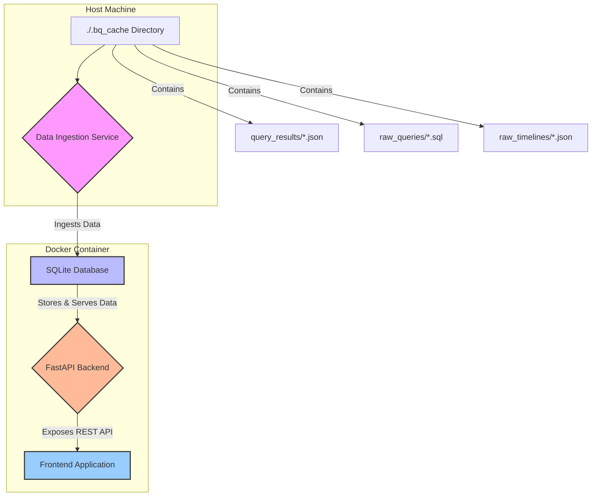

# BigQuery Cost Optimization Application: Architecture

This document outlines the architecture for the BigQuery Cost Optimization application. It covers the system components, technology stack, data model, and deployment strategy.

**Assumption:** This architecture assumes the presence of a `.bq_cache` directory at the root of the project, structured as described in the initial analysis. The system is designed to ingest data from this directory.

---

### 1. System Architecture Diagram

The system is designed as a monolithic application with a clear separation of concerns, containerized using Docker for portability and ease of deployment.



**Components:**

*   **Data Ingestion Service:** A Python script responsible for reading data from the `.bq_cache` directory, parsing the files, and loading them into the SQLite database. This service will be run as a one-off command or on a schedule.
*   **SQLite Database:** A file-based relational database chosen for its simplicity and ease of use in a single-container deployment. It will store the relational data from the BigQuery analysis.
*   **FastAPI Backend:** A Python-based API server that provides RESTful endpoints to query the data stored in the SQLite database.
*   **Frontend Application:** (Future enhancement) A web-based interface to visualize the data and recommendations. For this initial design, the focus is on the backend and data model.

---

### 2. Technology Stack

| Component             | Technology                                       |
| --------------------- | ------------------------------------------------ |
| **Backend API**       | Python 3.11, FastAPI                            |
| **Database**          | SQLite                                           |
| **Data Access (ORM)** | SQLAlchemy                                       |
| **Deployment**        | Docker, Docker Compose                           |
| **Data Handling**     | Pandas (for reading and processing JSON results) |

**Rationale:**

*   **Python/FastAPI:** High-performance, easy to learn, and excellent for building REST APIs. Its asynchronous capabilities are well-suited for I/O-bound operations.
*   **SQLite:** Zero-configuration, serverless, and self-contained. It is perfect for a small-to-medium-sized application that does not require the overhead of a full-fledged database server.
*   **SQLAlchemy:** Provides a robust Object-Relational Mapper (ORM), allowing for Python-native interaction with the SQL database, reducing the need to write raw SQL.
*   **Docker/Docker Compose:** Ensures a consistent and reproducible deployment environment, simplifying setup for local development and future cloud deployment.

---

### 3. Data Model (SQL Schema)

The data model is designed to capture the relationships between query jobs, their raw SQL, and their execution timelines.

```sql
-- Table to store the main query job results
CREATE TABLE IF NOT EXISTS query_jobs (
    job_id TEXT PRIMARY KEY,
    query_hash TEXT NOT NULL,
    project_id TEXT,
    user_email TEXT,
    total_bytes_billed BIGINT,
    total_slot_ms BIGINT,
    creation_time TIMESTAMP,
    start_time TIMESTAMP,
    end_time TIMESTAMP,
    timeline_details_file TEXT -- Path to the raw timeline file
);

-- Table to store the raw SQL queries, linked by query_hash
CREATE TABLE IF NOT EXISTS raw_queries (
    query_hash TEXT PRIMARY KEY,
    query_text TEXT NOT NULL
);

-- Table to store the detailed execution timeline information
CREATE TABLE IF NOT EXISTS execution_timelines (
    job_id TEXT PRIMARY KEY,
    timeline_json TEXT NOT NULL, -- Storing the raw JSON timeline
    FOREIGN KEY (job_id) REFERENCES query_jobs(job_id)
);

-- Create indexes to speed up lookups
CREATE INDEX IF NOT EXISTS idx_query_hash ON query_jobs(query_hash);
```

**Relationships:**

*   `query_jobs` is the central table, containing one record for each analyzed BigQuery job.
*   `raw_queries` stores the unique SQL queries. It is linked to `query_jobs` via the `query_hash` field (a one-to-many relationship from `raw_queries` to `query_jobs`).
*   `execution_timelines` stores the detailed performance timeline for each job. It is linked to `query_jobs` via the `job_id` (a one-to-one relationship).

---

### 4. Data Ingestion Plan

The data ingestion process will be handled by a Python script (`ingest.py`).

1.  **Read Main Results:** The script will first scan the `.bq_cache/query_results/` directory and read the main JSON results file.
2.  **Populate `query_jobs`:** For each job entry in the main results file, a record will be created in the `query_jobs` table.
3.  **Populate `raw_queries`:**
    *   For each job, the script will extract the `query_hash`.
    *   It will check if a query with that hash already exists in the `raw_queries` table.
    *   If not, it will read the content of the corresponding `.bq_cache/raw_queries/<query_hash>.sql` file and insert it into the `raw_queries` table.
4.  **Populate `execution_timelines`:**
    *   For each job, the script will use the `timeline_details_file` path.
    *   It will read the content of the corresponding `.bq_cache/raw_timelines/<timeline_details_file>` JSON file.
    *   The raw JSON content will be stored in the `execution_timelines` table, linked by `job_id`.

This process ensures that all relational data is correctly ingested and linked in the SQLite database.

---

### 5. Deployment Strategy (Local Docker)

The application will be containerized using Docker for local deployment.

**`Dockerfile`:**

```dockerfile
# Use an official Python runtime as a parent image
FROM python:3.11-slim

# Set the working directory in the container
WORKDIR /app

# Copy the requirements file and install dependencies
COPY requirements.txt requirements.txt
RUN pip install --no-cache-dir -r requirements.txt

# Copy the rest of the application code
COPY . .

# Command to run the data ingestion script (manual step)
# CMD ["python", "ingest.py"]

# Command to run the API server
CMD ["uvicorn", "main:app", "--host", "0.0.0.0", "--port", "8000"]
```

**`docker-compose.yml`:**

```yaml
version: '3.8'
services:
  bq-optimizer-app:
    build: .
    container_name: bq_optimizer_app
    ports:
      - "8000:8000"
    volumes:
      - ./db_data:/app/db_data
      - ./.bq_cache:/app/.bq_cache:ro # Mount cache as read-only
    environment:
      - DATABASE_URL=sqlite:///./db_data/bq_analyzer.db
```

**Deployment Steps:**

1.  **Create Project Structure:** Set up the directory structure as defined in the architecture.
2.  **Build the Docker Image:** Run `docker-compose build` from the directory containing the `docker-compose.yml` file.
3.  **Run Data Ingestion:** Execute the ingestion script within the container to populate the database.
    ```bash
    docker-compose run --rm bq-optimizer-app python ingest.py
    ```
4.  **Start the Application:** Start the API server.
    ```bash
    docker-compose up -d
    ```
5.  **Access the API:** The API will be available at `http://localhost:8000`.
