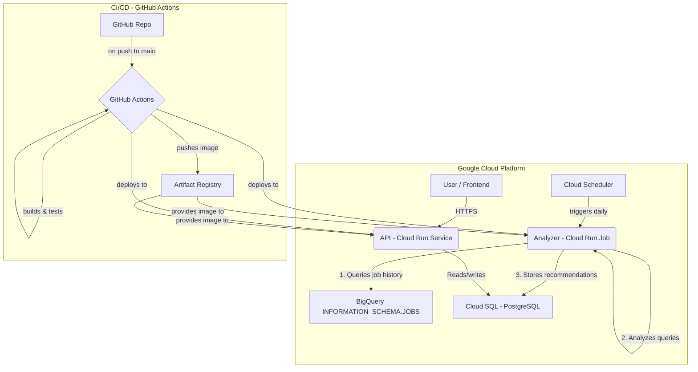

# BigQuery Cost Optimization Application: Architecture & Deployment Plan

## 1. System Architecture

This document outlines the architecture for an application designed to automatically detect and recommend cost optimizations for Google BigQuery usage, based on the analysis of `INFORMATION_SCHEMA.JOBS`.

The system is composed of two primary, decoupled components running on Google Cloud Platform (GCP):

1.  **Analyzer (Cloud Run Job):** A scheduled, containerized job responsible for periodically fetching BigQuery job history, analyzing query patterns for inefficiencies (e.g., full table scans, partition key misuse), and generating optimization recommendations.
2.  **Recommendations API (Cloud Run Service):** A containerized REST API that provides access to the stored recommendations, allowing users or a future frontend to view and manage them.

### Component Diagram



## 2. Technology Stack

The technology stack is chosen for its scalability, ecosystem maturity, and suitability for data processing and web services on GCP.

-   **Programming Language:** Python 3.10+
-   **API Framework:** FastAPI
-   **Data Processing/Analysis:** Pandas, google-cloud-bigquery library
-   **Database:** PostgreSQL (managed via Google Cloud SQL)
-   **Containerization:** Docker
-   **Cloud Platform:** Google Cloud Platform (GCP)
    -   **Compute (API):** Cloud Run Service (for stateless, scalable web service)
    -   **Compute (Analyzer):** Cloud Run Job (for scheduled, task-based execution)
    -   **Scheduling:** Cloud Scheduler
    -   **Database:** Cloud SQL for PostgreSQL
    -   **Container Registry:** Artifact Registry
    -   **Secrets Management:** Secret Manager
-   **CI/CD:** GitHub Actions

## 3. Data Model

A central PostgreSQL database will store the generated recommendations. A single table, `recommendations`, will be used initially.

### `recommendations` Table

This table stores individual optimization recommendations generated by the Analyzer job.

```sql
CREATE TABLE recommendations (
    id UUID PRIMARY KEY DEFAULT gen_random_uuid(),
    project_id VARCHAR(255) NOT NULL,
    user_email VARCHAR(255) NOT NULL,
    job_id VARCHAR(255) UNIQUE NOT NULL,
    query_hash VARCHAR(64) NOT NULL, -- SHA-256 hash of the normalized query text
    query_text TEXT NOT NULL,
    total_billed_gb NUMERIC(15, 5) NOT NULL,
    estimated_cost_usd NUMERIC(10, 5),
    inefficiency_type VARCHAR(100) NOT NULL, -- e.g., 'FULL_TABLE_SCAN', 'PARTITION_MISMATCH'
    recommendation_title VARCHAR(255) NOT NULL,
    recommendation_details TEXT NOT NULL,
    status VARCHAR(50) NOT NULL DEFAULT 'NEW', -- e.g., 'NEW', 'ACKNOWLEDGED', 'IMPLEMENTED', 'IGNORED'
    created_at TIMESTAMPTZ NOT NULL DEFAULT NOW(),
    updated_at TIMESTAMPTZ NOT NULL DEFAULT NOW()
);

-- Add indexes for common query patterns
CREATE INDEX idx_recommendations_project_id ON recommendations(project_id);
CREATE INDEX idx_recommendations_status ON recommendations(status);
CREATE INDEX idx_recommendations_query_hash ON recommendations(query_hash);
```

## 4. Deployment Strategy

The deployment will be automated via GitHub Actions and targets GCP.

### Step 1: GCP Project Setup & Prerequisites

1.  **Create GCP Project:** If not already existing.
2.  **Enable APIs:** In the GCP console or via gcloud CLI, enable the following APIs:
    -   Cloud Run API (`run.googleapis.com`)
    -   Cloud Build API (`cloudbuild.googleapis.com`)
    -   Artifact Registry API (`artifactregistry.googleapis.com`)
    -   Cloud SQL Admin API (`sqladmin.googleapis.com`)
    -   Secret Manager API (`secretmanager.googleapis.com`)
3.  **Create Cloud SQL Instance:** Provision a PostgreSQL instance in Cloud SQL. Note the **Instance connection name**.
4.  **Create Database:** Create a database (e.g., `bq_optimizer`) and a user for the application.
5.  **Create Service Account:** Create an IAM Service Account (e.g., `sa-bq-optimizer`) for the application.
    -   **Grant Roles:**
        -   `BigQuery Job User` (to run queries)
        -   `BigQuery Read Session User` (to read data)
        -   `Cloud SQL Client` (to connect to the database)
        -   `Secret Manager Secret Accessor` (to access secrets)
6.  **Store Secrets:** Store the database password in Secret Manager.

### Step 2: CI/CD Pipeline Setup (GitHub Actions)

1.  **Configure Auth:** Set up Workload Identity Federation between GitHub Actions and the GCP Service Account to allow passwordless authentication from the CI/CD pipeline.
2.  **Create Workflows:** In the `.github/workflows/` directory, create two separate YAML files: `deploy-analyzer.yml` and `deploy-api.yml`.
3.  **Workflow Steps (for each component):**
    -   Trigger on `push` to the `main` branch.
    -   Checkout code.
    -   Authenticate to Google Cloud.
    -   Run linters and tests.
    -   Build the Docker image using Cloud Build and push it to Artifact Registry.
    -   Deploy the new image to the appropriate Cloud Run Service or Job, injecting the database credentials from Secret Manager as environment variables.

### Step 3: Deploy Analyzer (Cloud Run Job)

1.  **Dockerfile:** Create `analyzer/Dockerfile`.
2.  **Push to `main`:** Trigger the `deploy-analyzer.yml` GitHub Actions workflow.
3.  **Post-Deployment:**
    -   Create a Cloud Scheduler job.
    -   **Target:** The `bq-analyzer` Cloud Run Job.
    -   **Schedule:** Define a cron schedule (e.g., `0 2 * * *` for 2 AM daily).
    -   **Authentication:** Use the same application service account to invoke the job.

### Step 4: Deploy API (Cloud Run Service)

1.  **Dockerfile:** Create `api/Dockerfile`.
2.  **Push to `main`:** Trigger the `deploy-api.yml` GitHub Actions workflow.
3.  **Post-Deployment:**
    -   The workflow deploys the container to a Cloud Run Service.
    -   Configure IAM to control access to the service (e.g., allow public access or restrict to specific users/groups).
    -   The API endpoint will be available at the URL provided by Cloud Run.
