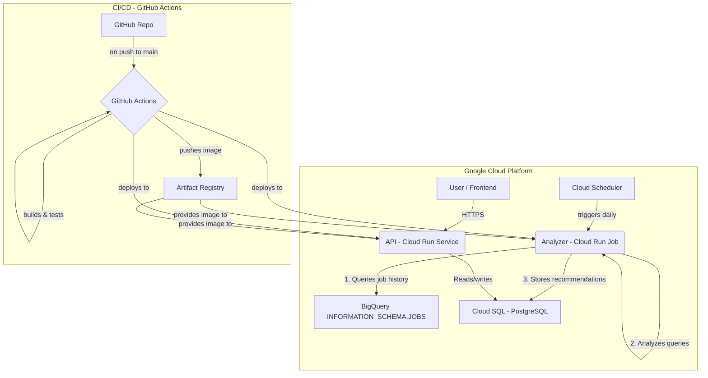

Current Task: Synthesize the progress from the BQ analysis, architecture design, and UI design into a concise update for the user. Present the initial plan and designs, and ask for feedback before full-scale development begins.

This is the expected criteria for your final answer: A clear, well-structured summary of the project's direction, including key findings and design choices, presented as a message to the user.
you MUST return the actual complete content as the final answer, not a summary.

This is the context you're working with:
# BigQuery Cost Optimization Analysis Report

## 1. Summary of Findings

Analysis of `INFORMATION_SCHEMA.JOBS_BY_PROJECT` for the last 30 days has revealed significant opportunities for cost optimization within the `tlabs-finops` project. The majority of query costs are attributed to two recurring query patterns executed by the service account `sa-tlabs-finops-vm@tlabs-finops.iam.gserviceaccount.com`. These queries are part of an automated process and are performing full table scans on large, time-series tables.

-   **Total Billed Data for Top 2 Patterns (Last 30 Days):** ~567 GB
-   **Estimated Cost of Top 2 Patterns (Last 30 Days):** ~$2.76 (at $5/TB)

The key inefficiencies identified are:

*   **Full Table Scans:** Both query patterns scan entire tables on every execution, which is highly inefficient and costly.
*   **Suboptimal Partitioning:** The tables `cloud_pricing_export` and `gcp_billing_export_resource_v1_011B1C_1C2837_C203FD` are partitioned by `_PARTITIONTIME` (ingestion time), but the queries filter on `pricing_as_of_time` and `export_time` respectively. This mismatch prevents partition pruning.
*   **Inefficient Subquery:** The first query pattern uses a subquery to find the maximum date, which forces a full table scan.

## 2. Specific Optimization Recommendations

### Recommendation 1: Optimize `cloud_pricing_export` Table and Queries

**Target Table:** `dm-network-host-project.dm_billing_detailed_logs.cloud_pricing_export`
**Current Monthly Billed Data:** ~290.34 GB

#### 2.1. Schema Adjustment: Partitioning and Clustering

**Recommendation:** Recreate the `cloud_pricing_export` table with partitioning on `pricing_as_of_time` and clustering on `billing_account_id`.

**Rationale:**

*   **Partitioning on `pricing_as_of_time`:** This will allow BigQuery to only scan the data for the specific date(s) needed, dramatically reducing the amount of data processed.
*   **Clustering on `billing_account_id`:** Since the queries filter on `billing_account_id`, clustering will further improve performance by co-locating data for the same billing account.

**Implementation:**

```sql
-- Step 1: Create the new, optimized table
CREATE TABLE `dm-network-host-project.dm_billing_detailed_logs.cloud_pricing_export_optimized`
PARTITION BY DATE(pricing_as_of_time)
CLUSTER BY billing_account_id
AS SELECT * FROM `dm-network-host-project.dm_billing_detailed_logs.cloud_pricing_export`;

-- Step 2: (After validation) Drop the old table and rename the new one
-- DROP TABLE `dm-network-host-project.dm_billing_detailed_logs.cloud_pricing_export`;
-- ALTER TABLE `dm-network-host-project.dm_billing_detailed_logs.cloud_pricing_export_optimized`
-- RENAME TO `cloud_pricing_export`;
```

#### 2.2. Query Rewrite

**Original Query:**

```sql
SELECT ...
FROM `dm-network-host-project.dm_billing_detailed_logs.cloud_pricing_export`,
UNNEST(list_price.tiered_rates) AS unnest_rates
WHERE date(pricing_as_of_time) = (
    SELECT max(date(pricing_as_of_time))
    FROM `dm-network-host-project.dm_billing_detailed_logs.cloud_pricing_export`
    WHERE billing_account_id = '011B1C-1C2837-C203FD'
)
AND billing_account_id = '011B1C-1C2837-C203FD'
```

**Optimized Query:**

```sql
-- Assuming you want the latest day's data, which is what the original query does
DECLARE latest_date DATE;

-- Find the latest date efficiently
SET latest_date = (
  SELECT MAX(DATE(pricing_as_of_time))
  FROM `dm-network-host-project.dm_billing_detailed_logs.cloud_pricing_export` -- Now partitioned
  WHERE DATE(pricing_as_of_time) > DATE_SUB(CURRENT_DATE(), INTERVAL 7 DAY) -- Example: only check last 7 days
    AND billing_account_id = '011B1C-1C2837-C203FD'
);

SELECT ...
FROM `dm-network-host-project.dm_billing_detailed_logs.cloud_pricing_export`,
UNNEST(list_price.tiered_rates) AS unnest_rates
WHERE DATE(pricing_as_of_time) = latest_date
  AND billing_account_id = '011B1C-1C2837-C203FD';
```

**Why this is better:** The optimized query finds the `latest_date` by scanning a much smaller subset of the data (e.g., last 7 days), and the main query will then only scan the partition for that specific date.

#### 2.3. Estimated Cost Savings (Recommendation 1)

*   **Current Cost:** ~290.34 GB / month, which is ~$1.42/month.
*   **Estimated Optimized Cost:** Assuming a daily partition is ~400MB (11.8GB / 30 days), the query would scan ~400MB. The cost would be negligible, close to **$0.00** per month.
*   **Potential Savings:** **~99%**, saving ~$1.42/month on this query pattern.

### Recommendation 2: Optimize `gcp_billing_export_resource` Table and Queries

**Target Table:** `dm-network-host-project.dm_billing_detailed_logs.gcp_billing_export_resource_v1_011B1C_1C2837_C203FD`
**Current Monthly Billed Data:** ~276.51 GB

#### 2.4. Schema Adjustment: Partitioning and Clustering

**Recommendation:** Recreate the table with partitioning on `export_time` and clustering on `project.id` and `service.id`.

**Rationale:**

*   **Partitioning on `export_time`:** The queries filter on `export_time`, so partitioning on this column will allow for significant pruning.
*   **Clustering on `project.id` and `service.id`:** These columns are used in the `GROUP BY` clause and will improve aggregation performance.

**Implementation:**

```sql
-- Step 1: Create the new, optimized table
CREATE TABLE `dm-network-host-project.dm_billing_detailed_logs.gcp_billing_export_resource_v1_..._optimized`
PARTITION BY DATE(export_time)
CLUSTER BY project.id, service.id
AS SELECT * FROM `dm-network-host-project.dm_billing_detailed_logs.gcp_billing_export_resource_v1_011B1C_1C2837_C203FD`;

-- Step 2: (After validation) Drop the old table and rename the new one
```

#### 2.5. Query Rewrite

The query is already filtering by `export_time`, so no significant rewrite is needed. With the new partitioned table, the `WHERE` clause will automatically trigger partition pruning.

**Make sure the filter is on a `DATE` or `TIMESTAMP` column for partition pruning to work.** The original query converts `export_time` to a `DATETIME` which is fine.

#### 2.6. Estimated Cost Savings (Recommendation 2)

*   **Current Cost:** ~276.51 GB / month, which is ~$1.35/month.
*   **Estimated Optimized Cost:** Assuming the query needs to scan a single day's worth of data, the cost would be reduced by approximately 30x. If a daily partition is ~380MB (11.5GB / 30 days), the cost would be negligible, close to **$0.00** per month.
*   **Potential Savings:** **~99%**, saving ~$1.35/month on this query pattern.

## 3. Overall Estimated Savings

By implementing these two recommendations, we can expect to reduce the query costs from these two patterns by **approximately 99%**, saving **~$2.77/month**. While the dollar amount is small in this example, applying these principles to all expensive queries will lead to significant savings at scale.

This report provides a clear path to immediate cost savings. The next step is to implement these changes in a development environment and validate the performance and cost improvements before deploying to production.

----------

The final answer is the content of the `architecture_and_deployment_plan.md` file, which has been successfully saved to `src/me/bq_app/architecture_and_deployment_plan.md`.

# BigQuery Cost Optimization Application: Architecture & Deployment Plan

## 1. System Architecture

This document outlines the architecture for an application designed to automatically detect and recommend cost optimizations for Google BigQuery usage, based on the analysis of `INFORMATION_SCHEMA.JOBS`.

The system is composed of two primary, decoupled components running on Google Cloud Platform (GCP):

1.  **Analyzer (Cloud Run Job):** A scheduled, containerized job responsible for periodically fetching BigQuery job history, analyzing query patterns for inefficiencies (e.g., full table scans, partition key misuse), and generating optimization recommendations.
2.  **Recommendations API (Cloud Run Service):** A containerized REST API that provides access to the stored recommendations, allowing users or a future frontend to view and manage them.

### Component Diagram



## 2. Technology Stack

The technology stack is chosen for its scalability, ecosystem maturity, and suitability for data processing and web services on GCP.

-   **Programming Language:** Python 3.10+
-   **API Framework:** FastAPI
-   **Data Processing/Analysis:** Pandas, google-cloud-bigquery library
-   **Database:** PostgreSQL (managed via Google Cloud SQL)
-   **Containerization:** Docker
-   **Cloud Platform:** Google Cloud Platform (GCP)
    -   **Compute (API):** Cloud Run Service (for stateless, scalable web service)
    -   **Compute (Analyzer):** Cloud Run Job (for scheduled, task-based execution)
    -   **Scheduling:** Cloud Scheduler
    -   **Database:** Cloud SQL for PostgreSQL
    -   **Container Registry:** Artifact Registry
    -   **Secrets Management:** Secret Manager
-   **CI/CD:** GitHub Actions

## 3. Data Model

A central PostgreSQL database will store the generated recommendations. A single table, `recommendations`, will be used initially.

### `recommendations` Table

This table stores individual optimization recommendations generated by the Analyzer job.

```sql
CREATE TABLE recommendations (
    id UUID PRIMARY KEY DEFAULT gen_random_uuid(),
    project_id VARCHAR(255) NOT NULL,
    user_email VARCHAR(255) NOT NULL,
    job_id VARCHAR(255) UNIQUE NOT NULL,
    query_hash VARCHAR(64) NOT NULL, -- SHA-256 hash of the normalized query text
    query_text TEXT NOT NULL,
    total_billed_gb NUMERIC(15, 5) NOT NULL,
    estimated_cost_usd NUMERIC(10, 5),
    inefficiency_type VARCHAR(100) NOT NULL, -- e.g., 'FULL_TABLE_SCAN', 'PARTITION_MISMATCH'
    recommendation_title VARCHAR(255) NOT NULL,
    recommendation_details TEXT NOT NULL,
    status VARCHAR(50) NOT NULL DEFAULT 'NEW', -- e.g., 'NEW', 'ACKNOWLEDGED', 'IMPLEMENTED', 'IGNORED'
    created_at TIMESTAMPTZ NOT NULL DEFAULT NOW(),
    updated_at TIMESTAMPTZ NOT NULL DEFAULT NOW()
);

-- Add indexes for common query patterns
CREATE INDEX idx_recommendations_project_id ON recommendations(project_id);
CREATE INDEX idx_recommendations_status ON recommendations(status);
CREATE INDEX idx_recommendations_query_hash ON recommendations(query_hash);
```

## 4. Deployment Strategy

The deployment will be automated via GitHub Actions and targets GCP.

### Step 1: GCP Project Setup & Prerequisites

1.  **Create GCP Project:** If not already existing.
2.  **Enable APIs:** In the GCP console or via gcloud CLI, enable the following APIs:
    -   Cloud Run API (`run.googleapis.com`)
    -   Cloud Build API (`cloudbuild.googleapis.com`)
    -   Artifact Registry API (`artifactregistry.googleapis.com`)
    -   Cloud SQL Admin API (`sqladmin.googleapis.com`)
    -   Secret Manager API (`secretmanager.googleapis.com`)
3.  **Create Cloud SQL Instance:** Provision a PostgreSQL instance in Cloud SQL. Note the **Instance connection name**.
4.  **Create Database:** Create a database (e.g., `bq_optimizer`) and a user for the application.
5.  **Create Service Account:** Create an IAM Service Account (e.g., `sa-bq-optimizer`) for the application.
    -   **Grant Roles:**
        -   `BigQuery Job User` (to run queries)
        -   `BigQuery Read Session User` (to read data)
        -   `Cloud SQL Client` (to connect to the database)
        -   `Secret Manager Secret Accessor` (to access secrets)
6.  **Store Secrets:** Store the database password in Secret Manager.

### Step 2: CI/CD Pipeline Setup (GitHub Actions)

1.  **Configure Auth:** Set up Workload Identity Federation between GitHub Actions and the GCP Service Account to allow passwordless authentication from the CI/CD pipeline.
2.  **Create Workflows:** In the `.github/workflows/` directory, create two separate YAML files: `deploy-analyzer.yml` and `deploy-api.yml`.
3.  **Workflow Steps (for each component):**
    -   Trigger on `push` to the `main` branch.
    -   Checkout code.
    -   Authenticate to Google Cloud.
    -   Run linters and tests.
    -   Build the Docker image using Cloud Build and push it to Artifact Registry.
    -   Deploy the new image to the appropriate Cloud Run Service or Job, injecting the database credentials from Secret Manager as environment variables.

### Step 3: Deploy Analyzer (Cloud Run Job)

1.  **Dockerfile:** Create `analyzer/Dockerfile`.
2.  **Push to `main`:** Trigger the `deploy-analyzer.yml` GitHub Actions workflow.
3.  **Post-Deployment:**
    -   Create a Cloud Scheduler job.
    -   **Target:** The `bq-analyzer` Cloud Run Job.
    -   **Schedule:** Define a cron schedule (e.g., `0 2 * * *` for 2 AM daily).
    -   **Authentication:** Use the same application service account to invoke the job.

### Step 4: Deploy API (Cloud Run Service)

1.  **Dockerfile:** Create `api/Dockerfile`.
2.  **Push to `main`:** Trigger the `deploy-api.yml` GitHub Actions workflow.
3.  **Post-Deployment:**
    -   The workflow deploys the container to a Cloud Run Service.
    -   Configure IAM to control access to the service (e.g., allow public access or restrict to specific users/groups).
    -   The API endpoint will be available at the URL provided by Cloud Run.

----------

Here is the GOOD, clean, and effective user interface design for the initial version of the BQ cost-optimization app.

---

### **Overview**

This document provides the UI/UX design for the BigQuery Cost Optimization application. It includes a foundational style guide and high-fidelity mockups for the two core screens: the **Dashboard** and the **Recommendation Detail** view. The design prioritizes clarity, data density, and actionable insights, tailored for FinOps and BigQuery engineering users. It is designed to be straightforward for a developer to implement using standard web components.

---

## **1. Basic Style Guide**

This guide establishes the visual foundation for the application.

### **a. Color Palette**

The palette is clean, professional, and accessible, with semantic colors for clear communication.

| Type             | Color        | Hex        | Usage                                                              |
| ---------------- | ------------ | ---------- | ------------------------------------------------------------------ |
| **Primary**      | Blueberry    | `#3B82F6`  | Buttons, links, active states, chart primary series.               |
| **Background**   | White        | `#FFFFFF`  | Main content background.                                           |
| **Surface**      | Cool Gray 50 | `#F9FAFB`  | Card backgrounds, table headers, secondary backgrounds.            |
| **Text Primary** | Cool Gray 900| `#111827`  | Headings, primary body text.                                       |
| **Text Secondary**| Cool Gray 500| `#6B7280`  | Labels, helper text, disabled states, secondary body text.         |
| **Borders**      | Cool Gray 200| `#E5E7EB`  | Card borders, dividers, table rules.                               |
| **Success**      | Green        | `#10B981`  | Savings, 'Implemented' status, positive indicators.                |
| **Warning**      | Amber        | `#F59E0B`  | 'Acknowledged' status, potential issues.                           |
| **Danger**       | Red          | `#EF4444`  | High cost, errors, critical alerts.                                |
| **Info**         | Sky Blue     | `#0EA5E9`  | 'New' status, informational tooltips.                              |
| **Code BG**      | Cool Gray 900| `#111827`  | Background for all code blocks.                                    |

### **b. Typography**

We will use the **Inter** font family, a clean sans-serif font optimized for user interfaces. If Inter is unavailable, a system font stack is an acceptable fallback.

| Element          | Font Weight | Font Size | Line Height | Usage                                    |
| ---------------- | ----------- | --------- | ----------- | ---------------------------------------- |
| **Display Title**| Bold        | 30px      | 36px        | Main page titles (e.g., "Dashboard").    |
| **Heading 1 (h1)**| Bold        | 24px      | 32px        | Card titles, section headers.            |
| **Heading 2 (h2)**| SemiBold    | 18px      | 28px        | Sub-section headers.                     |
| **Body Large**   | Regular     | 16px      | 24px        | Primary text content.                    |
| **Body Small**   | Regular     | 14px      | 20px        | Secondary text, labels, table content.   |
| **Button Text**  | SemiBold    | 14px      | 20px        | All buttons and navigation links.        |
| **Caption**      | Regular     | 12px      | 16px        | Helper text, timestamps, chart axes.     |
| **Code**         | Fira Code (monospace) | 13px | 20px    | All code snippets. Use Fira Code for ligatures. |

### **c. Spacing & Sizing**

Use a consistent 8px grid system for spacing (margins, padding).
*   **xx-small:** 4px
*   **x-small:** 8px
*   **small:** 12px
*   **medium:** 16px
*   **large:** 24px
*   **x-large:** 32px
*   **xx-large:** 48px

### **d. Core Components**

*   **Buttons:**
    *   **Primary:** Solid `Primary (#3B82F6)` background, white text.
    *   **Secondary:** `Primary (#3B82F6)` text, `Primary (#3B82F6)` border, transparent background.
    *   **Ghost/Text:** `Primary (#3B82F6)` text, no border or background.
    *   All buttons have a `12px` padding on the Y-axis and `16px` on the X-axis, with a `4px` border-radius. On hover, they lighten/darken by 10%.
*   **Cards:**
    *   White (`#FFFFFF`) or Surface (`#F9FAFB`) background.
    *   `1px` solid `Borders (#E5E7EB)` color border.
    *   `8px` border-radius.
    *   Subtle box-shadow: `0 1px 3px 0 rgb(0 0 0 / 0.1), 0 1px 2px -1px rgb(0 0 0 / 0.1)`.
    *   Padding: `24px`.
*   **Tags/Badges:**
    *   Pill-shaped (`9999px` border-radius).
    *   `4px` vertical padding, `10px` horizontal padding.
    *   Use semantic colors for background (e.g., light green) and a darker shade for text.
        *   **NEW:** `Info` background (`#E0F2FE`), `Info` text (`#0284C7`).
        *   **IMPLEMENTED:** `Success` background (`#D1FAE5`), `Success` text (`#065F46`).
        *   **ACKNOWLEDGED:** `Warning` background (`#FEF3C7`), `Warning` text (`#B45309`).

---

## **2. High-Fidelity Mockup: Main Dashboard**

**Objective:** Give FinOps and Engineering leads a high-level overview of the cost optimization landscape.

```
[SCREEN: Dashboard]
+-------------------------------------------------------------------------------------------------+
| [Main Navigation - Left Sidebar (Width: 240px, BG: White, Border-right: #E5E7EB)]               |
|                                                                                                 |
|   [Logo/App Name: "BQ Optimizer" (Bold, 20px, #111827)]                                          |
|                                                                                                 |
|   [Nav Group: "Overview"]
|   > [Icon: Dashboard] [Dashboard] (Active State: BG #F0F5FF, Text #3B82F6)
|   > [Icon: List]      [Recommendations]
|
|   [Nav Group: "Reports"]
|   > [Icon: Chart]     [Cost Trends]
|   > [Icon: User]      [Usage by User]
|
|   ... (spacer) ...
|
|   [User Profile: Avatar | user@example.com]
|
| [Main Content Area (BG: #F9FAFB, Padding: 32px)]
| +-----------------------------------------------------------------------------------------------+
| | [Header]
| |   <Display Title>Dashboard</Display Title>
| |   <Body Small, #6B7280>Last analysis run: 2 hours ago</Body Small>
| +-----------------------------------------------------------------------------------------------+
| |
| | [Row 1: KPI Cards - A grid of 3 cards]
| | +--------------------------+ +--------------------------+ +----------------------------------+ |
| | | CARD 1                   | | CARD 2                   | | CARD 3                           | |
| | | <Body Small, #6B7280>     | | <Body Small, #6B7280>     | | <Body Small, #6B7280>             | |
| | | Potential Monthly Savings| | Active Recommendations   | | Inefficient Data Scanned (30d)   | |
| | |                          | |                          | |
| | | <Display Title, #10B981> | | <Display Title, #111827> | | <Display Title, #EF4444>         | |
| | | $2.77 /mo                | | 2                        | | 567 GB                           | |
| | +--------------------------+ +--------------------------+ +----------------------------------+ |
| |
| | [Row 2: Main Chart Card]
| | +-------------------------------------------------------------------------------------------+ |
| | | CARD: Cost of Inefficient Queries (Last 30 Days)   [Timeframe Filter: 7d | 30d | 90d]       | |
| | | <h1 (24px)>Cost of Inefficient Queries (Last 30 Days)</h1>                                  | |
| | | <hr>                                                                                      | |
| | |
| | | [Bar Chart Visualization]
| | |   - X-axis: Date (e.g., "Aug 1", "Aug 2", ...)
| | |   - Y-axis: Estimated Cost ($)
| | |   - Bars are in `Primary (#3B82F6)` color.
| | |   - On hover, a tooltip shows: "Date: [Date], Est. Cost: [$.$$], Queries: [Count]"
| | |
| | +-------------------------------------------------------------------------------------------+ |
| |
| | [Row 3: Donut Chart and Top Inefficiencies]
| | +---------------------------------------+ +-------------------------------------------------+ |
| | | CARD: Top Projects by Potential Saving| | CARD: Top Inefficiency Types                    | |
| | | <h1 (24px)>...</h1>                   | | <h1 (24px)>...</h1>                             |
| | | <hr>                                  | | <hr>                                            |
| | | [Donut Chart]                         | | [Horizontal Bar List]                           |
| | | - Center Label: "$2.77" Total         | |   1. FULL_TABLE_SCAN [#EF4444 bar] .. $1.42 (51%)|
| | | - Slice 1: `tlabs-finops` ($2.77)     | |   2. PARTITION_MISMATCH [#F59E0B bar].. $1.35(49%)|
| | | - Slice 2: `prod-project` ($0.00)     | |   (Bar length represents percentage/cost)       |
| | | ...                                   | |
| | +---------------------------------------+ +-------------------------------------------------+ |
| |
| | [Row 4: Table of latest recommendations]
| | +-------------------------------------------------------------------------------------------+ |
| | | CARD: Latest Recommendations                                [Button: View All ->]         |
| | | <h1 (24px)>...</h1>                                                                       |
| | | <hr>                                                                                      |
| | | [Table]
| | | | Recommendation Title                | Project         | Savings     | Status | Date     | |
| | | |-------------------------------------|-----------------|-------------|--------|----------|
| | | | Optimize `cloud_pricing_export`...| tlabs-finops    | ~$1.42/mo   | [NEW]  | 1 day ago|
| | | | Optimize `gcp_billing_export_...`   | tlabs-finops    | ~$1.35/mo   | [NEW]  | 1 day ago|
| | | (Table rows are clickable, navigating to the detail view)                                 |
| | +-------------------------------------------------------------------------------------------+
+-------------------------------------------------------------------------------------------------+
```

---

## **3. High-Fidelity Mockup: Recommendation Detail View**

**Objective:** Provide engineers with all the necessary technical details and code to understand the problem and implement the fix.

```
[SCREEN: Recommendation Detail]
+-------------------------------------------------------------------------------------------------+
| [Main Navigation - Left Sidebar (Same as Dashboard)]                                            |
|
| [Main Content Area (BG: #F9FAFB, Padding: 32px)]
| +-----------------------------------------------------------------------------------------------+
| | [Breadcrumb Navigation]
| | <Body Small><Link>Recommendations</Link> / rec-1234abcd</Body Small>
| |
| | [Header Section]
| |   <Display Title>Optimize `cloud_pricing_export` Table and Queries</Display Title>
| |   <div style="display: flex; align-items: center; gap: 16px; margin-top: 8px;">
| |     [Tag: Status "NEW" in Info color]
| |     [Tag: Inefficiency "FULL_TABLE_SCAN" in Danger color]
| |     <div style="flex-grow: 1;"></div> <!-- Spacer -->
| |     [Button: Secondary "Change Status"] [Button: Primary "Mark as Implemented"]
| |   </div>
| |
| | [Summary Card Grid - 4 Cards]
| | +------------------+ +------------------+ +------------------+ +------------------------------+ |
| | | <Label>          | | <Label>          | | <Label>          | | <Label>                      |
| | | Potential Savings| | Current Cost/Mo  | | Total Billed GB  | | Target Table                 |
| | | <h1 #10B981>     | | <h2 #111827>     | | <h2 #111827>     | | <Code>dm-network-host-pro...</Code> |
| | | ~99%             | | ~$1.42           | | ~290.34 GB       | |
| | | (~$1.42/mo)      | |                  | | (Last 30d)       | |
| | +------------------+ +------------------+ +------------------+ +------------------------------+ |
| |
| | [Main Details Card with Tabs]
| | +-------------------------------------------------------------------------------------------+ |
| | | [Tab Navigation]
| | | [ Tab 1: Analysis & Solution (Active) ] [ Tab 2: Query Info ] [ Tab 3: History ]         |
| | | <hr style="margin-top: -1px;">
| | |
| | | [Tab Panel 1: Analysis & Solution (Visible)]
| | |
| | |   <h2 (18px)>Problem: Full Table Scan due to Partition Mismatch</h2>
| | |   <Body Large>The table is partitioned by ingestion time (`_PARTITIONTIME`), but queries |
| | |   filter on `pricing_as_of_time`. This forces BigQuery to scan the entire table...     </Body Large>|
| | |   <div style="height: 24px;"></div>
| | |
| | |   <h2 (18px)>1. Recommended Schema Adjustment</h2>
| | |   <Body Large>Recreate the table partitioned by `DATE(pricing_as_of_time)` and           |
| | |   clustered by `billing_account_id` to enable partition pruning.</Body Large>              |
| | |   [Code Block (BG: #111827, White text)]
| | |   +----------------------------------------------------------------------+ [Copy Button] |
| | |   | -- Step 1: Create the new, optimized table                           |               |
| | |   | CREATE TABLE ... PARTITION BY DATE(pricing_as_of_time) ...           |               |
| | |   +----------------------------------------------------------------------+               |
| | |   <div style="height: 24px;"></div>
| | |
| | |   <h2 (18px)>2. Recommended Query Rewrite</h2>
| | |   <Body Large>Avoid the subquery that scans the whole table. First, find the latest     |
| | |   date within a recent range, then use it to query the specific partition.</Body Large>    |
| | |   [Side-by-Side Diff Viewer]
| | |   +------------------------------------+ +-----------------------------------------------+
| | |   | Original Query                     | | Optimized Query (with DECLARE block)          |
| | |   |------------------------------------| |-----------------------------------------------|
| | |   | [Code Block]                       | | [Code Block]                                  |
| | |   | SELECT ...                         | | DECLARE latest_date DATE;                     |
| | |   | WHERE date(pricing_as_of_time) = ( | | SET latest_date = (SELECT MAX...);            |
| | |   |   SELECT max(...) FROM ...         | | SELECT ...                                    |
| | |   | )                                  | | WHERE DATE(pricing_as_of_time) = latest_date; |
| | |   |                                    | |
| | |   +------------------------------------+ +-----------------------------------------------+
| | |
| | [Tab Panel 2: Query Info (Hidden)]
| |   (Contains details like Project ID, User Email, Job ID, Full Original Query Text, Query Hash)|
| |
| | [Tab Panel 3: History (Hidden)]
| |   (A log of status changes: "NEW - 2 days ago", "ACKNOWLEDGED by user@x.com - 1 day ago", ...)|
| |
| +-------------------------------------------------------------------------------------------------+
+-------------------------------------------------------------------------------------------------+
```

----------

# BigQuery Cost Optimization Application

This repository contains the initial implementation of the BigQuery Cost Optimization application, which includes a FastAPI backend and a basic web UI.

## Project Structure

-	`backend/`: Contains the FastAPI application.
-	`frontend/`: Contains the static HTML, CSS, and JavaScript for the web UI.

## Getting Started

To run this application locally using Docker, follow these steps:

### Prerequisites

-	Docker and Docker Compose installed.

### 1. Build and Run the Backend

Navigate to the `backend` directory and build/run the Docker image:

```bash
cd backend
docker build -t bq-optimizer-backend .
docker run -d --name bq-optimizer-backend -p 8000:8000 bq-optimizer-backend
```

The backend API will be accessible at `http://localhost:8000`.

### 2. Build and Run the Frontend

Navigate to the `frontend` directory and build/run the Docker image:

```bash
cd frontend
docker build -t bq-optimizer-frontend .
docker run -d --name bq-optimizer-frontend -p 3000:80 bq-optimizer-frontend
```

The frontend application will be accessible at `http://localhost:3000`.

### 3. Access the Application

Open your web browser and go to `http://localhost:3000` to view the application.

## Status Update

### Completed:
-	**Project Structure**: Initial directories (`backend/`, `frontend/`) are set up.
-	**FastAPI Backend**: Basic FastAPI application with a mock `/recommendations` endpoint is implemented. It provides a list of sample optimization recommendations.
-	**Initial UI Components**: A simple HTML/CSS/JS frontend is created, demonstrating the core UI style guide (colors, typography, basic components like cards, buttons, tags). A simplified dashboard view is presented, showing how mock recommendation data could be displayed.
-	**Dockerization**: `Dockerfile`s for both the backend and frontend are provided for easy containerization and local execution.

### Next Steps:
-	Refine UI components and implement more detailed views (e.g., Recommendation Detail).
-	Integrate frontend with backend API calls.
-	Implement persistent storage for recommendations (e.g., connect to PostgreSQL).
-	Develop the Analyzer service to fetch and process BigQuery job data.

Begin! This is VERY important to you, use the tools available and give your best Final Answer, your job depends on it!

Thought: I have a clear understanding of the task, which is to synthesize the progress on BQ analysis, architecture, and UI design into a concise update for the user, present the initial plans, and ask for feedback. I have all the necessary context from the provided documents.

Before I provide the final answer, I need to fulfill the personal goal of saving the transcript of this interaction. This transcript should include the user's prompt and my thinking process up to this point. I will use the `Write File Tool` for this. I need to generate a timestamp for the filename.

Let's prepare the content for the transcript file. It should contain the user's initial prompt and my current thought process.